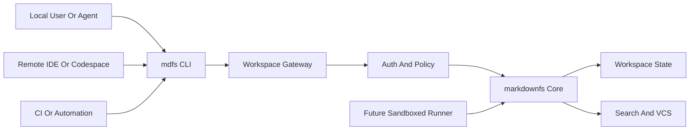

# CLI Cloud Bridge

This guide describes how to connect `markdownfs` to cloud execution environments while keeping the user experience CLI-first.

## Recommendation

Build a hosted workspace gateway and a small `mdfs` CLI wrapper before attempting a real OS mount.

This is the best first bridge because:

- agents already know how to use command-line tools
- the current product already maps cleanly to CLI verbs
- a gateway centralizes concurrency and persistence
- the same gateway can later support MCP, HTTP, hosted execution, and mounts

## User Experience

The end-user mental model should be:

```bash
mdfs ls /incidents
mdfs cat /incidents/checkout-latency/evidence.md
mdfs grep timeout /runbooks
mdfs search "what changed after the payment deploy?"
mdfs commit "initial investigation"
mdfs log
mdfs revert abcd1234
```

Later:

```bash
mdfs run "python analyze.py"
```

## Why Not Start With FUSE

FUSE or another mount layer can come later, but it is a poor first bridge for cloud agents.

Problems with leading with a mount:

- more platform-specific implementation work
- harder auth and lifecycle management
- harder to reason about concurrency
- lower demo velocity than a focused CLI wrapper

The first bridge should optimize for product clarity and speed of adoption, not perfect filesystem transparency.

## Architecture



## Gateway Responsibilities

The hosted gateway should:

- authenticate users and agents
- map CLI commands to workspace operations
- serialize or coordinate writes safely
- expose HTTP APIs for automation
- expose future execution APIs
- provide a stable endpoint for remote clients

This is where cloud-specific integration belongs, not inside every client.

## Cloud Targets

The bridge should support four environments with the same CLI:

### 1. Local laptop

Best for development and human review.

### 2. Remote IDE or cloud development environment

Examples:

- GitHub Codespaces
- remote Cursor or VS Code workspace
- cloud VM accessed over SSH

### 3. CI job

Use the CLI to inspect, update, and commit workspace state in automation pipelines.

### 4. Hosted sandbox

Future execution layer that runs commands against a workspace from the same gateway.

## Suggested Command Mapping

### Existing capabilities

- `mdfs ls` -> `GET /fs/{path}`
- `mdfs cat` -> `GET /fs/{path}`
- `mdfs write` -> `PUT /fs/{path}`
- `mdfs grep` -> `GET /search/grep`
- `mdfs find` -> `GET /search/find`
- `mdfs tree` -> `GET /tree/{path}`
- `mdfs commit` -> `POST /vcs/commit`
- `mdfs log` -> `GET /vcs/log`
- `mdfs revert` -> `POST /vcs/revert`
- `mdfs status` -> `GET /vcs/status`

### Future capabilities

- `mdfs search` -> semantic index endpoint
- `mdfs diff` -> future diff/status endpoint
- `mdfs run` -> future runs API

## Authentication Model

Use short-lived tokens or agent tokens issued by the gateway.

The CLI should avoid direct state-file access in cloud mode. It should act as a thin client over the gateway.

Benefits:

- safer remote usage
- central auditability
- cleaner policy enforcement
- consistent behavior across environments

## First Release Scope

The first `mdfs` release should do only three things well:

1. connect to a remote workspace endpoint
2. expose the current file/search/version verbs
3. use bearer-token authentication cleanly

The current implementation also supports hosted workspace records and workspace-scoped bearer tokens through the gateway.

That is enough to power:

- live demos
- agent shells
- CI automation
- remote terminals

## Migration Path

### Now

Use shell commands like `curl` and `jq` against `mdfs-server`.

### Next

Wrap the current HTTP API in `mdfs`.

### Later

Add semantic search, diff, and run commands.

### Much later

Add optional mounts where platform integration truly matters.

## Product Statement

The cloud bridge should be sold as:

> Bring your agent terminal anywhere. The same workspace works from local shells, remote IDEs, CI, and future hosted runners.

That message is clearer and more defensible than “we mounted a cloud filesystem.”
