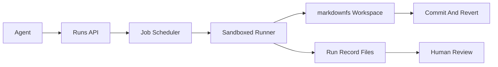

# Execution Roadmap

This guide describes the minimal architecture required to evolve `markdownfs` from an agent workspace into an execution layer.

## Goal

Move from:

- persistent markdown workspaces

to:

- persistent workspaces plus safe, auditable command execution against those workspaces

## Product Principle

Execution should be attached to the workspace, not separate from it.

Every run should leave behind durable artifacts that humans and agents can inspect later.

## Phase 1: Run Records Without Full Sandbox

Before building a general-purpose runner, define a workspace-native run model.

### Run layout

Represent each run under a reserved directory:

```text
/runs/<run-id>/
├── prompt.md
├── command.md
├── stdout.md
├── stderr.md
├── result.md
├── metadata.md
└── artifacts/
```

### What each file stores

- `prompt.md`: the user request or agent goal
- `command.md`: the exact command or tool request being executed
- `stdout.md`: captured standard output
- `stderr.md`: captured standard error
- `result.md`: human-readable summary or final status
- `metadata.md`: agent id, start time, end time, exit code, workspace id, source commit

### Why this phase matters

- It makes execution auditable before the runner is complex.
- It aligns execution history with the core markdown-first product.
- It lets humans review runs in the same workspace they already trust.

## Phase 2: Job Runner

Add a job system that can execute commands against a workspace.

### Responsibilities

- create a run record
- stage a workspace snapshot or working copy
- run a command
- stream or capture output
- write outputs back into `/runs/<run-id>/`
- update final status

### Minimal API

- `POST /runs`
- `GET /runs/{id}`
- `GET /runs/{id}/stdout`
- `GET /runs/{id}/stderr`
- `POST /runs/{id}/cancel`

### Suggested states

- `queued`
- `running`
- `succeeded`
- `failed`
- `cancelled`
- `timed_out`

## Phase 3: Sandbox Policy

Once execution exists, control becomes the product.

### Required controls

- command timeout
- output size caps
- memory and CPU limits
- environment variable allowlist
- working-directory scoping
- optional network policy
- artifact size limits

### Policy model

Policies should be attached to:

- workspace
- agent identity
- run type

That allows different controls for a read-only search agent versus a code-generating agent.

## Phase 4: Output Capture And Review

Captured output should not just be raw bytes.

### Needed features

- streaming output for live demos and operator confidence
- persisted output for later inspection
- summarized result file for fast review
- optional commit or snapshot after successful run

### Human review flow

1. Agent runs a command.
2. Output lands in `/runs/<run-id>/`.
3. Human reviews `result.md` and diff/status output.
4. Human accepts, rejects, or reverts the resulting workspace state.

## Recommended Architecture



## Suggested Build Order

### Step 1

Create the run-record file model and reserve `/runs/`.

### Step 2

Add job metadata, status transitions, and result persistence.

### Step 3

Build a minimal runner with:

- one command
- one workspace
- timeout
- stdout/stderr capture

### Step 4

Add policy controls and cancellation.

### Step 5

Add optional auto-commit, branch/snapshot support, and provenance links to commits.

## Non-Goals For The First Execution Release

Avoid these in the first execution version:

- distributed scheduling
- arbitrary package installation
- broad outbound network access by default
- multi-step workflow orchestration
- multi-language SDK parity on day one

The first execution release should be narrow, safe, and reviewable.

## Success Criteria

The execution layer is ready when:

- every run produces durable workspace artifacts
- humans can explain what happened by reading the workspace
- failures are preserved, not hidden
- agent actions can be reviewed and reverted like file edits
