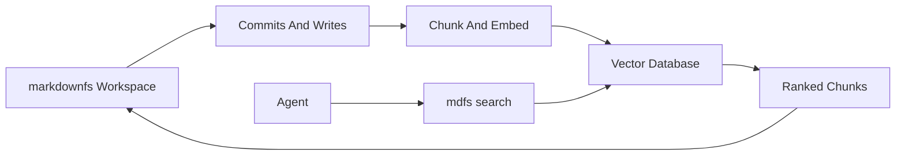

# Semantic Index

This guide describes how to add vector-based discovery to `markdownfs` without turning the vector database into the source of truth.

## Principle

`markdownfs` should remain the canonical store for:

- file contents
- permissions
- history
- commits
- rollback

The vector database should be a **derived index** for retrieval.

## Why This Matters

Vector databases are good at:

- semantic recall
- ranking related chunks
- filtering by metadata

They are not good primary systems for:

- exact audit trails
- permissions and ownership
- version history
- deterministic rollback

That is why the right architecture is:

> filesystem truth plus semantic recall

## Recommended Flow



## Indexing Model

### Source

Index markdown files from the canonical workspace.

### Chunking

Chunk by markdown structure first:

- document title
- heading section
- subsection

This is better than arbitrary fixed-size chunks for human-readable agent memory.

### Metadata

Every chunk should store metadata such as:

- workspace id
- file path
- heading path
- commit hash
- author or agent id
- timestamp
- permissions scope

This metadata is what makes semantic search useful in a real workspace product.

## Query Flow

A semantic query should not directly replace file access.

Preferred flow:

1. Agent calls `mdfs search "what did we learn from the last payment timeout incident?"`
2. Search returns ranked chunks with file paths, headings, and scores.
3. Agent opens the exact files with `mdfs cat` or another deterministic read.
4. Agent writes new conclusions back into the workspace.
5. Agent commits or reverts as needed.

This keeps retrieval approximate but final state deterministic.

## Example Search Result Shape

```json
{
  "results": [
    {
      "path": "/runbooks/payment-service.md",
      "heading": "Prior Learning",
      "score": 0.93,
      "excerpt": "On 2026-03-15, checkout latency increased after payment-service raised a confirmation timeout..."
    }
  ]
}
```

## Index Update Strategy

### On write

Re-index the changed file or changed markdown sections.

### On commit

Attach the active commit hash to the indexed view so semantic search can reference a known workspace state.

### On revert

Refresh the index to match the reverted workspace view.

## Demo Value

Semantic search improves the demo because it shows that the workspace supports both:

- deterministic file operations
- AI-native discovery across prior knowledge

That is a stronger product story than raw grep alone.

## Product Boundaries

Avoid these mistakes:

- storing the only copy of agent memory in the vector database
- skipping file reads after search results
- ignoring permissions when returning search hits
- treating embeddings as a substitute for commit history

## Suggested CLI Surface

When semantic search is added, keep it simple:

```bash
mdfs search "why did checkout latency spike after the payment deploy?"
```

The CLI should return:

- the top files and headings
- short excerpts
- enough metadata for the agent to decide what to open next

## Build Order

1. Add a chunker for markdown headings and sections.
2. Add an embedding/indexing worker.
3. Add metadata-aware retrieval.
4. Add a search API.
5. Add `mdfs search`.

The important constraint is unchanged throughout: the vector layer accelerates retrieval, but `markdownfs` remains the truth.
